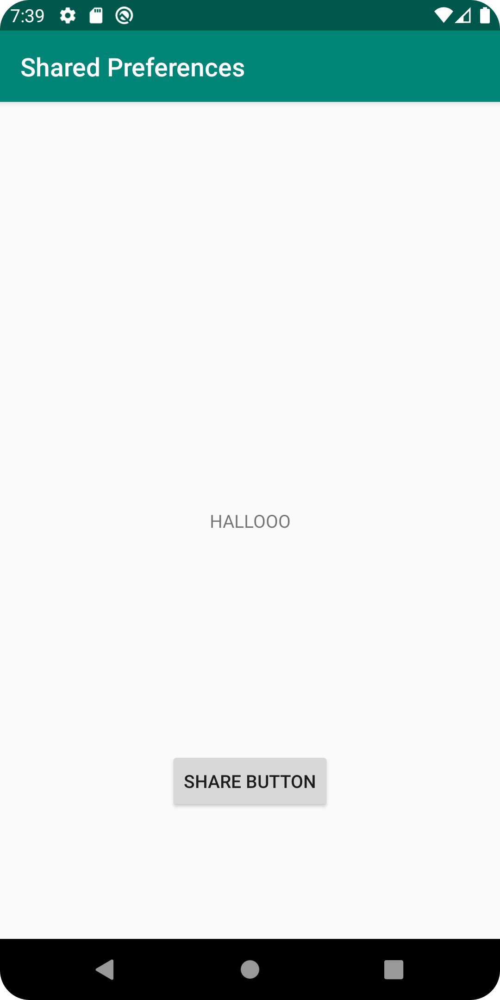
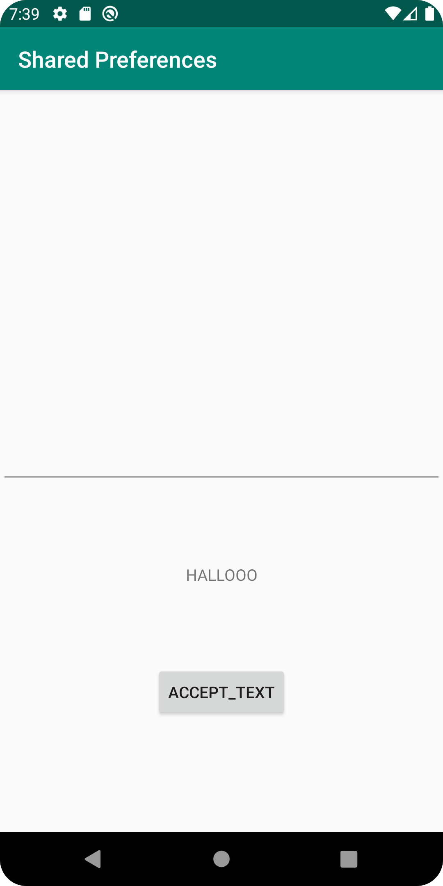
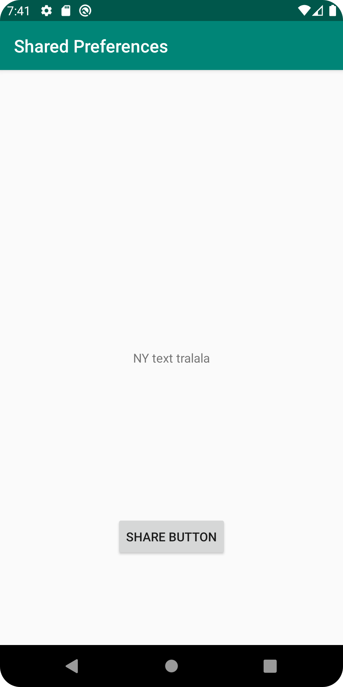

# Rapport Assignment 6: Shared preferences


Det första som gjordes var att skapa en ny `Layout Resorce File`, det implementerades en *Knapp* och *TextView* i denna nya aktivitet. 
I `Activity_Main.xml` skapas en knapp som senare används i `MainActivity.java` för att öppna den tidigare skapade aktiviteten, detta görs via ett intent vid knapptryck. 

```java
public class MainActivity extends AppCompatActivity {

    TextView textView;
    Button openActivityTwo;                              //  <<-----
    Intent intent;                                       //  <<-----
    SharedPreferences mainSharedPreference;
    SharedPreferences.Editor mainSharedPreferenceEditor;


    @Override
    protected void onCreate(Bundle savedInstanceState) {
        super.onCreate(savedInstanceState);
        setContentView(R.layout.activity_main);
        Toolbar toolbar = findViewById(R.id.toolbar);
        setSupportActionBar(toolbar);

        textView = findViewById(R.id.main_textview);

        intent = new Intent(MainActivity.this, SecondActivity.class);                        //
                                                                                             // 
        openActivityTwo = findViewById(R.id.activity_two_button);                            //
        openActivityTwo.setOnClickListener(new View.OnClickListener() {                      //
            @Override                                                                        // Används för att öppna activity_second
            public void onClick(View v) {                                                    //
                onTapp();                                                                    //
            }                                                                                //
        });                                                                                  //
    }

    private void onTapp() {
        startActivity(intent);       // aktiverar intenten som öppnar activity_second
    }
}
```

Det skrevs till ett ID till TextViewn som fanns förprogrammerad i `activity_main` för att möjliggöra __findViewByiD__ då den inte hade någon.  
Alla widgets som skapats i `activity_secound` kopplas samman med variabler via __findViewByiD__

När det var klart skapades instanser av `SharedPreferences` och `SharedPreferences.Editor` klasserna i *onCreate* metoden, notera att *getSharedPreferences*  får ett namn "_Preferences_", detta så att delandet kan ske mellan aktiviteter.

```java
public class SecondActivity extends AppCompatActivity {

    private TextView textView;                                          //
    private EditText editText;                                          // diverse widgets skapas
    private Button acceptTextButton;                                    //

    private SharedPreferences mySharedPreferenceRef;                    // shared preference object skapad
    private SharedPreferences.Editor mySharedPreferenceEditor;          //

    @Override
    protected void onCreate(Bundle savedInstanceState) {
        super.onCreate(savedInstanceState);
        setContentView(R.layout.activity_second);

        acceptTextButton = findViewById(R.id.accept_text_Button);               // knappen kommer användas för att registrera text som skrivits i editText widgeten.
        acceptTextButton.setOnClickListener(new View.OnClickListener() {        //
            @Override
            public void onClick(View v) {
                onTappSecond();
            }
        });

        textView = findViewById(R.id.second_activity_text);
        editText = findViewById(R.id.test_edit_demo);


        mySharedPreferenceRef = getSharedPreferences("Preferences", (MODE_PRIVATE));                 // shared preference initierad
        mySharedPreferenceEditor = mySharedPreferenceRef.edit();                                    //

        textView.setText(mySharedPreferenceRef.getString("text_from_edittext", "nothing written here.."));   // textViewn fylls med text, i detta fall finns det ingen text i registrerad till denna nyckel. Därför kommer meddelandet "nothing written here.." skrivas in istället.

    }
}
```

Den knapp som skapades i aktivitet två sätter först texten i textViewn, för att sedan spara strängen i _sharedpreference_. 

```java
    // denna metod nås vid knapptryck

    private void onTappSecond(){
        textView.setText(editText.getText().toString());                                            // det som står skrivet i EditText widgeten skickas till textView och vissas upp.
        mySharedPreferenceEditor.putString("text_from_edittext", textView.getText().toString());    // placerar String-värdert i en preference
        mySharedPreferenceEditor.apply();                                                           // notera att det är samma "key" värde som i (mySharedPreferenceRef.getString("text_from_edittext","nothing written here..")
    }
    
```

För att värdet i stängen ska vara synlig i `MainActivity` så måste kod skrivas i metoden onResume(), då denna metod är det första som körs när man återkommer till aktiviteten.
Här initieras `SharedPreferences` och `SharedPreferences.Editor` som medlems variabler, notera att _getSharedPreferences_ har samma namn _"Preferences"_ och kan därför nå den delade stängen. 

```java
    @Override
    public void onResume() {

        super.onResume();

        mainSharedPreference = getSharedPreferences("Preferences", MODE_PRIVATE);
        mainSharedPreferenceEditor = mainSharedPreference.edit();

        textView.setText(mainSharedPreference.getString("text_from_edittext", "nothing written here.."));               // här hämtas Strängen via nyckeln

    }
```




